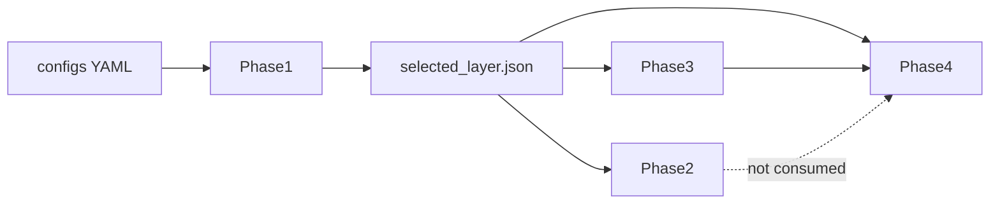

# Pipeline architecture

Companion to [AGENTS.md](../AGENTS.md). Operator commands: [README.md](../README.md). Scientific spec: [PLAN.md](../PLAN.md).

## Handoff chain

One YAML (`configs/phase1_smoke.yaml` or `configs/phase1_full.yaml`) carries settings for all four phases. Phase 2, 3, and 4 load the frozen Phase 1 handoff from `selected_layer.json`. Phase 4 also loads Phase 3 detectors. Phase 4 never reads Phase 2 outputs.

Identity hashes exclude machine-local dataset and output paths, so a complete run directory can move between machines without changing identity.

## Phases

**Phase 1 — layer selection.** Stages: `prepare` (CPU), `capture` (GPU), `analyze` (GPU). Builds frozen attack/control pairs from BIPIA dev tasks, captures final-prompt-token activations at fitted J-lens layers, then sparse nonnegative reconstruction (`k=25`, 512 screened candidates) of `D_ℓ = W_U J_ℓ`. Selects ℓ* by BIPIA validation signal. Key outputs: `pair_manifest.jsonl`, activation/decomposition caches, `selected_layer.json`, `selected_layer_direction.pt`.

**Phase 2 — coarse removal.** Stages: `generate` (GPU), `analyze` (CPU + OpenRouter). Subtracts α · reconstructed J-space at ℓ* for α ∈ {0.0, 0.5, 1.0}. ASR uses a fixed semantic YES/NO/UNKNOWN judge (`openai/gpt-4.1-mini` via OpenRouter). Clean utility is ROUGE against BIPIA `construct_response`. Key outputs: `generations.jsonl`, `judgments.jsonl`, `phase2_results.parquet`, `phase2_summary.csv`. A Phase 2 effect shows functional involvement, not injection-specific causality.

**Phase 3 — freeze two detectors.** One CPU command. No Gemma, lens, BIPIA sources, Phase 2, or API key. Mean detector reuses the Phase 1 direction; logistic detector fits sparse CSR features on Phase 1 train. Thresholds chosen on Phase 1 validation (macro balanced accuracy). Key outputs: `mean_detector.pt`, `logistic_detector.pt`, `phase3_metrics.csv`. Development results only; Phase 4 is the unbiased eval.

**Phase 4 — held-out transfer.** Stages: `generate` (GPU), `analyze` (CPU; OpenRouter for BIPIA only). Frozen layer, feature map, detector parameters, and thresholds. Adapters: BIPIA official `test.jsonl`, AgentDojo v1.2.2 (`important_instructions`, no defense), InjecAgent base setting. Key outputs: `bipia_records.jsonl`, `agentdojo_records.jsonl`, `injecagent_records.jsonl`, `phase4_metrics.csv`. No Phase 4 example is used for tuning. Smoke is deterministic integration validation only.

## Modules

| Path | Role |
| --- | --- |
| [`runtime.py`](../src/jspace_research/runtime.py) | Atomic JSON/parquet/csv/torch writes, resumable JSONL, identity/provenance checks |
| [`model.py`](../src/jspace_research/model.py) | `HuggingFaceModelAdapter`: capture, generation, intervention hook at final prompt token |
| [`phase1/cli.py`](../src/jspace_research/phase1/cli.py) | `jspace-phase1` |
| [`phase1/config.py`](../src/jspace_research/phase1/config.py) | Frozen dataclasses + YAML load; pin and constant validators |
| [`phase1/data.py`](../src/jspace_research/phase1/data.py) | BIPIA pair manifest, revision check, chat rendering |
| [`phase1/adapters.py`](../src/jspace_research/phase1/adapters.py) | Jacobian-lens load from Hugging Face Hub |
| [`phase1/jspace.py`](../src/jspace_research/phase1/jspace.py) | Screened nonnegative greedy pursuit |
| [`phase1/cache.py`](../src/jspace_research/phase1/cache.py) | Resumable uint16-bfloat16 activation memmaps |
| [`phase1/pipeline.py`](../src/jspace_research/phase1/pipeline.py) | `prepare` / `capture` / `analyze` |
| [`phase1/artifacts.py`](../src/jspace_research/phase1/artifacts.py) | `Phase1Handoff`, `load_selected_layer` |
| [`phase2/pipeline.py`](../src/jspace_research/phase2/pipeline.py) | Intervention generation + scoring orchestration |
| [`phase2/scoring.py`](../src/jspace_research/phase2/scoring.py) | OpenRouter judge, ASR, ROUGE utility |
| [`phase3/pipeline.py`](../src/jspace_research/phase3/pipeline.py) | Mean + logistic training and threshold selection |
| [`phase4/pipeline.py`](../src/jspace_research/phase4/pipeline.py) | Transfer generate / analyze |
| [`phase4/detectors.py`](../src/jspace_research/phase4/detectors.py) | Load frozen Phase 3 detectors; score captured activations |
| [`phase4/bipia.py`](../src/jspace_research/phase4/bipia.py) | Official BIPIA test cases |
| [`phase4/agentdojo.py`](../src/jspace_research/phase4/agentdojo.py) | AgentDojo suites and native outcomes |
| [`phase4/injecagent.py`](../src/jspace_research/phase4/injecagent.py) | InjecAgent base-setting cases |
| [`phase4/common.py`](../src/jspace_research/phase4/common.py) | Shared record resume helpers |

Phase-local `config.py`, `cli.py`, and `artifacts.py` follow the same pattern in phases 2–4.

## Handoff and resume

Handoff JSON uses `schema_version: 1` and `frozen: true`. Each phase writes lightweight `provenance.json`. Reuse the exact same `--output-dir` to resume. A truncated final JSONL record is discarded and recomputed; malformed earlier records or mismatched config, parent handoff, prompt, generation, judge, or cache shape cause a hard failure.

After `prepare` freezes the manifest, later Phase 1 stages read the manifest and do not need the original source files. Phase 3 rewrites its final artifacts safely (no stage cache). Phase 2/4 generation and judgments resume by job/case ID.

## Identifiers

| Kind | Format | Example |
| --- | --- | --- |
| Pair | `{task}:{split}:{index:05d}` | `email:train:00000` |
| Phase 2 job | `example_{index:06d}_alpha_{alpha_index}` | `example_000000_alpha_0` |
| Phase 2 example | `{pair_id}:{condition}` | `email:train:00000:attack` |
| Phase 4 BIPIA | `bipia:{context_id}:control` or attack + `:matched-control` | |
| Phase 4 AgentDojo | `agentdojo:{suite}:{condition}:{user}:{injection\|none}` | |
| Phase 4 InjecAgent | `injecagent:{subgroup}:{index:04d}` | |
| Phase 1 run | `phase1-{config_hash[:12]}-{manifest_hash[:12]}` | |
| Phase 4 run | `phase4-{config_hash[:12]}-{phase1_run_id}` | |

YAML task keys: `email`, `qa`, `table`, `abstract`, `code` (EmailQA, WebQA, TableQA, Summarization, CodeQA). Train attack variants `{0,1,2}`; validation `{3,4}`. Insertion positions: `start`, `middle`, `end`.

## External data

BIPIA, AgentDojo, and InjecAgent are cloned checkouts. Runtime code verifies `git rev-parse` against the pinned commits. They are not vendored.

WebQA and Summarization `train.jsonl` (Phase 1 full) and BIPIA-format `qa/test.jsonl` / `abstract/test.jsonl` (Phase 4 full) are researcher-provided. The pipeline does not download or reconstruct them. Smoke uses BIPIA EmailQA only.

`OPENROUTER_API_KEY` is required for Phase 2 `analyze` and Phase 4 BIPIA `analyze`. Credentials are never stored in artifacts. Hugging Face auth is required to download Gemma and the lens.
