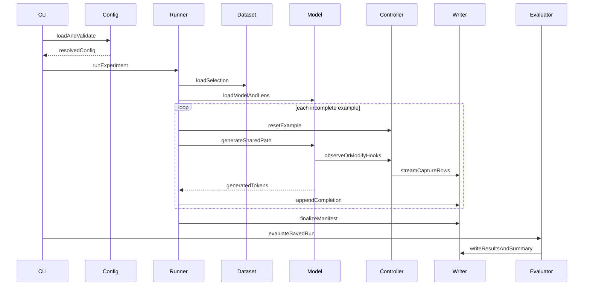

# 02 — Architecture and project structure

## Design direction

The HumanEval reference has clear, small modules, but
[`run_baseline.py`](../../qwen-humaneval-jlens/src/run_baseline.py) and
[`run_intervention.py`](../../qwen-humaneval-jlens/src/run_intervention.py)
duplicate dataset loading, generation, resume handling, and output writing.
That makes accidental condition drift possible.

The GSM8K project should use one runner and inject condition-specific behavior
through a hook/controller interface. Baseline, no-op, and intervention then
share the exact same prompt and generation path.

## Proposed project tree

```text
qwen-gsm8k-jlens/
├── README.md
├── pyproject.toml
├── uv.lock
├── .python-version
├── configs/
│   ├── default.yaml
│   ├── smoke.yaml
│   ├── hosts/
│   │   ├── apple.yaml
│   │   ├── amd.yaml
│   │   └── nvidia.yaml
│   ├── runs/
│   │   ├── small-smoke.yaml
│   │   ├── medium-validation.yaml
│   │   └── large-full.yaml
│   └── experiments/
│       ├── baseline.yaml
│       ├── no-op.yaml
│       └── mean-replace.yaml
├── plans/
│   └── ... planning documents ...
├── notebooks/
│   ├── 00-run-overview.ipynb
│   ├── 01-gsm8k-accuracy.ipynb
│   ├── 02-jspace-capture.ipynb
│   ├── 03-intervention-comparison.ipynb
│   ├── 04-cross-hardware-replication.ipynb
│   └── 05-example-explorer.ipynb
├── scripts/
│   ├── detect-host.py
│   ├── uv-env
│   └── verify-environment.py
├── src/
│   └── gsm8k_jspace/
│       ├── __init__.py
│       ├── cli.py
│       ├── config.py
│       ├── types.py
│       ├── datasets/
│       │   ├── __init__.py
│       │   └── gsm8k.py
│       ├── models/
│       │   ├── __init__.py
│       │   ├── loader.py
│       │   └── jlens_adapter.py
│       ├── platform/
│       │   ├── __init__.py
│       │   ├── capabilities.py
│       │   ├── device.py
│       │   ├── memory.py
│       │   └── diagnostics.py
│       ├── prompting/
│       │   ├── __init__.py
│       │   └── gsm8k.py
│       ├── capture/
│       │   ├── __init__.py
│       │   ├── selectors.py
│       │   ├── recorder.py
│       │   └── hooks.py
│       ├── interventions/
│       │   ├── __init__.py
│       │   ├── base.py
│       │   ├── no_op.py
│       │   └── mean_replace.py
│       ├── runner/
│       │   ├── __init__.py
│       │   ├── experiment.py
│       │   └── generation.py
│       ├── evaluation/
│       │   ├── __init__.py
│       │   ├── answer_parser.py
│       │   ├── evaluator.py
│       │   └── compare.py
│       ├── artifacts/
│       │   ├── __init__.py
│       │   ├── manifest.py
│       │   └── writer.py
│       └── analysis/
│           ├── __init__.py
│           ├── loaders.py
│           ├── tables.py
│           ├── statistics.py
│           └── plots.py
└── tests/
    ├── fixtures/
    ├── test_config.py
    ├── test_gsm8k_data.py
    ├── test_answer_parser.py
    ├── test_selectors.py
    ├── test_capture.py
    ├── test_intervention.py
    ├── test_artifacts.py
    └── test_smoke_tiny_model.py
```

Generated `outputs/` is intentionally outside `src/` and ignored by git.

## Component responsibilities

### `config.py`

- Parse YAML into typed, validated settings.
- Apply intentional CLI overrides.
- Resolve defaults into a complete config.
- Reject incompatible combinations before expensive loading.
- Compute a stable configuration fingerprint.

### `datasets/gsm8k.py`

- Load `openai/gsm8k`, configuration `main`.
- Assign a stable example ID independent of list order.
- Remove calculator annotations from reference rationales only where needed.
- Select and persist a deterministic subset.
- Return plain typed records so downstream code does not depend on
  Hugging Face Dataset objects.

### `prompting/gsm8k.py`

- Own prompt templates and their version names.
- Format zero-shot or configured few-shot prompts.
- Keep the final-answer instruction stable across conditions.
- Save the rendered prompt with each completion.

### `models/loader.py` and `models/jlens_adapter.py`

- Load model/tokenizer from config and put the model in evaluation mode.
- Reuse the model/J-Lens compatibility checks demonstrated by
  [`load_jlens.py`](../../qwen-humaneval-jlens/src/load_jlens.py).
- Expose model layers, projection, back-projection, unembedding, and metadata
  behind a narrow interface.
- Infer placement from actual tensors so Accelerate offload and split device
  maps do not depend on one global device.

### `platform/`

- Detect MPS, NVIDIA CUDA, ROCm/HIP, and CPU correctly.
- Resolve device and dtype from requested settings and operation probes.
- Keep platform-specific synchronization/memory calls behind one interface.
- Estimate model, lens, pseudo-inverse, KV-cache, and capture memory before
  expensive loading.
- Support CPU computation/caching of pseudo-inverses when the accelerator
  lacks an operation or memory.
- Write normalized diagnostics into every run's environment metadata.

PyTorch exposes ROCm devices through much of the `torch.cuda` namespace, so
backend detection must inspect `torch.version.hip` and must not label every
`torch.cuda.is_available()` device as NVIDIA.

### `capture/`

- Resolve layer selectors and token selectors separately.
- Observe hidden and J-Space states without modifying model output.
- Buffer small records and stream them to the artifact writer.
- Support capture in both baseline and intervention runs.
- Record pre-intervention and, when configured, post-intervention values.

### `interventions/`

All conditions implement the same lifecycle:

```python
reset_example(example_id, prompt_length)
before_generation()
hook(layer, hidden_states, step_context)
after_generation()
summary()
```

- Baseline installs no modifying hook.
- No-op installs the same hook locations but returns the original output
  exactly.
- `mean_replace` initially ports the tested HumanEval method.
- Future methods are independent modules rather than branches in one large
  hook function.

### `runner/experiment.py`

- Create or validate the run directory.
- Load the immutable dataset selection.
- Resume from completed example IDs.
- Reset condition-local state for each example.
- Call the single shared generation function.
- Write one completion record atomically.
- Finalize capture and condition summaries.

### `evaluation/`

- Parse a final numeric answer deterministically.
- Compare normalized predicted and gold answers.
- Write per-example and summary results without loading the model.
- Compare two completed runs by stable example ID.

### `artifacts/`

- Own all file schemas and atomic writing.
- Keep run metadata separate from high-volume capture data.
- Prevent append/resume against incompatible manifests.
- Expose streaming writers so activations do not accumulate in memory.

### `analysis/` and `notebooks/`

- Keep artifact loading, joins, statistics, tables, and plots in reusable
  Python modules.
- Use notebooks only to parameterize and present those functions.
- Stream/filter large capture datasets before creating pandas DataFrames.
- Save executed notebooks, standalone HTML, figures, and backing CSV tables.
- Validate run compatibility and show environment/fallback warnings before
  rendering comparisons.

## Runtime data flow



## Reuse boundaries

Reuse:

- the parent `jlens` package's model wrapper and Jacobian lens;
- model/J-Lens compatibility behavior from the HumanEval loader;
- layer resolution semantics where useful;
- intervention mathematics after separating it from HumanEval-specific code;
- `clean_gsm8k_answer` logic from
  [`jlens/benchmark.py`](../../jlens/benchmark.py).

Do not reuse directly:

- HumanEval stop strings or Python code extraction;
- subprocess execution evaluation;
- hard-coded HumanEval baseline scores;
- duplicated runners;
- generated reports containing fixed experiment interpretations.

## CLI surface

One module entry point should expose:

```text
python -m gsm8k_jspace run --config configs/smoke.yaml
python -m gsm8k_jspace evaluate --run outputs/gsm8k/<run_id>
python -m gsm8k_jspace compare --baseline <run_dir> --candidate <run_dir>
python -m gsm8k_jspace inspect-config --config <path>
```

The `run` command may optionally evaluate after generation, but saved
completions must always remain independently reevaluable.
