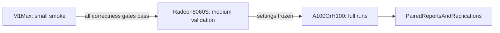

# 08 — uv environments and hardware run tiers

## Goal

Use `uv` for all Python dependency and virtual-environment management while
keeping incompatible PyTorch accelerator builds isolated:

| host | environment | PyTorch backend | workload tier |
|---|---|---|---|
| M1 Max MacBook Pro | `.venv-mps` | MPS | small smoke runs |
| Desktop Framework with Radeon 8060S | `.venv-rocm` | ROCm/HIP | medium validation runs |
| A100 or H100 server | `.venv-cuda` | CUDA | long, full benchmark runs |
| developer/CI CPU | `.venv-cpu` | CPU | unit and tiny-model tests |

Official uv guidance:

- [Using uv with PyTorch](https://docs.astral.sh/uv/guides/integration/pytorch/)
- [`UV_PROJECT_ENVIRONMENT`](https://docs.astral.sh/uv/concepts/projects/config/#project-environment-path)

## Important behavior

`uv --torch-backend=auto` can inspect the host and choose a compatible PyTorch
backend/index. It does not automatically choose a different virtual-environment
directory.

The project therefore needs a host-profile launcher that:

1. detects macOS/MPS, NVIDIA CUDA, AMD ROCm/HIP, or CPU;
2. maps that backend to a dedicated `UV_PROJECT_ENVIRONMENT`;
3. invokes `uv sync --locked` with the chosen torch backend/profile;
4. runs platform diagnostics before launching the benchmark;
5. prints and records every resolved choice.

Automatic selection is a convenience, not hidden experiment configuration.
Model, capture, intervention, and dataset settings remain in explicit YAML.

## Proposed project additions

```text
qwen-gsm8k-jlens/
├── pyproject.toml
├── uv.lock
├── .python-version
├── configs/
│   ├── hosts/
│   │   ├── m1-max.yaml
│   │   ├── radeon-8060s.yaml
│   │   └── nvidia-datacenter.yaml
│   └── runs/
│       ├── small-smoke.yaml
│       ├── medium-validation.yaml
│       └── large-full.yaml
└── scripts/
    ├── detect-host.py
    ├── uv-env
    └── verify-environment.py
```

Host files contain only execution settings such as backend, dtype, offload,
linear-algebra device, and memory thresholds. Run files contain scientific
settings such as selected examples, layers, token strategy, intervention, and
capture fields. The final resolved config records both inputs.

## Environment selection contract

The launcher resolves:

```text
Darwin + arm64 + MPS available
    -> profile=mps
    -> UV_PROJECT_ENVIRONMENT=.venv-mps
    -> native macOS PyTorch wheel

Linux + torch/driver probe reports HIP/AMD
    -> profile=rocm
    -> UV_PROJECT_ENVIRONMENT=.venv-rocm
    -> UV_TORCH_BACKEND=auto or validated explicit ROCm backend

Linux + NVIDIA driver available
    -> profile=cuda
    -> UV_PROJECT_ENVIRONMENT=.venv-cuda
    -> UV_TORCH_BACKEND=auto or validated explicit CUDA backend

otherwise
    -> profile=cpu
    -> UV_PROJECT_ENVIRONMENT=.venv-cpu
    -> UV_TORCH_BACKEND=cpu
```

Detection must not import the project environment's PyTorch before that
environment exists. Use OS/architecture plus host tools or uv's own backend
detection for initial selection, then verify using PyTorch after synchronization.

The second-stage verifier is authoritative:

```python
torch.backends.mps.is_available()
torch.cuda.is_available()
torch.version.hip
torch.version.cuda
```

If initial detection and PyTorch verification disagree, stop with diagnostics.
Never continue on CPU silently.

## Commands

User-facing commands should be stable across hosts:

```bash
./scripts/uv-env sync
./scripts/uv-env diagnose
./scripts/uv-env run --config configs/runs/small-smoke.yaml
```

Equivalent explicit commands remain available for debugging:

```bash
UV_PROJECT_ENVIRONMENT=.venv-mps uv sync --locked
UV_PROJECT_ENVIRONMENT=.venv-rocm uv sync --locked --torch-backend=auto
UV_PROJECT_ENVIRONMENT=.venv-cuda uv sync --locked --torch-backend=auto
UV_PROJECT_ENVIRONMENT=.venv-cpu uv sync --locked --torch-backend=cpu
```

For production A100/H100 and Radeon runs, replace `auto` with the backend
version validated by the server/driver matrix when reproducibility requires it.
The resolved torch wheel/version is always recorded.

## pyproject and lock design

Use one `pyproject.toml` for common dependencies and development tools. PyTorch
sources use explicit indexes/profile markers so accelerator indexes cannot
supply unrelated packages.

The implementation should follow uv's current PyTorch source syntax rather than
copying a version-specific example into this plan. At implementation time:

1. use `uv add`/`uv lock` with the current official MPS/PyPI, ROCm, and CUDA
   indexes;
2. declare supported environments for macOS arm64 and Linux x86_64;
3. make CPU/MPS, ROCm, and CUDA selections mutually exclusive;
4. use explicit indexes for torch-family packages;
5. commit `uv.lock`;
6. require `uv sync --locked` on experiment hosts.

Do not maintain hand-written `requirements-mps.txt`, `requirements-rocm.txt`,
and `requirements-cuda.txt` alongside uv; two dependency systems would drift.

If one universal lock cannot represent the vendor wheel combination validated
for Radeon 8060S, keep a dedicated committed ROCm lock/config profile rather
than unlocking dependencies on the experiment host.

## Small tier — M1 Max MacBook Pro

Purpose: fast developer feedback and correctness, not final performance claims.

Recommended run:

- 5–10 fixed GSM8K examples;
- baseline without capture;
- observation-only capture at 2–3 layers;
- no-op equality check;
- one low-strength intervention;
- `generated_last` first, then a short `all_generated` selector smoke;
- full vectors disabled;
- pseudo-inverse computed/cached on CPU;
- greedy decoding and the same prompt/parser version as larger tiers.

Required gates:

- MPS resolves successfully and does not silently use CPU;
- memory preflight passes for the actual M1 Max memory size;
- baseline and observation-only completions match;
- baseline and no-op generated token IDs match;
- saved artifacts reevaluate without loading the model;
- repeated examples do not leak unified memory.

If the 9B model does not fit the particular M1 Max, use explicit CPU offload or
a tiny model for plumbing. Do not label a smaller/identity-lens smoke result as
the Qwen 9B scientific baseline.

## Medium tier — Framework desktop with Radeon 8060S

Purpose: validate the real model/lens and calibrate experiment settings on ROCm
before consuming datacenter GPU time.

Recommended run:

- fixed 100-example stratified or seeded subset;
- clean baseline, observation-only baseline, and no-op;
- selected-layer capture with norms/top-k, no full vectors initially;
- preregistered small intervention strength sweep;
- at least one matched random control;
- interruption/resume test;
- repeated memory and thermal stability checks.

Required gates:

- official supported Radeon 8060S driver/ROCm environment;
- backend recorded as ROCm/HIP, not CUDA;
- all operation probes pass or approved CPU linear-algebra fallback is recorded;
- 100% baseline/no-op token equality on the medium subset;
- capture files pass index/hash integrity checks;
- no fallback or device-map difference between compared conditions.

The same immutable 100-example selection manifest is reused across every medium
condition.

## Large tier — A100 or H100 server

Purpose: final full benchmark and long-running sweeps.

Recommended run:

- all 1,319 GSM8K test examples;
- complete same-GPU baseline and no-op gate;
- full observation and intervention conditions;
- chosen preregistered strengths/layers from the medium tier;
- matched random-direction/coordinate controls;
- optional repeated seeds only where sampling or random controls require them;
- resumable per-example artifacts and periodic integrity checks.

Operational policy:

- do not combine an A100 baseline with an H100 intervention;
- use one GPU model/backend for each primary paired comparison;
- keep A100 and H100 results as separate replication groups;
- record GPU model, memory capacity, driver, CUDA, torch wheel, dtype, and
  deterministic settings;
- compute/cache only required pseudo-inverses;
- run the no-op gate again on the selected server even if it passed elsewhere.

The final report can compare replication summaries across M1, Radeon, A100, and
H100, but paired causal statistics use runs from the same hardware class.

## Promotion workflow



Promotion criteria:

### M1 to Radeon

- parser, artifact, resume, selector, capture, and no-op tests pass;
- run configuration schema is frozen for the medium run;
- known MPS fallbacks are documented.

### Radeon to A100/H100

- real Qwen/J-Lens compatibility passes;
- medium baseline/no-op exactness passes;
- intervention strength does not destroy output validity;
- capture volume and runtime are estimated for 1,319 examples;
- final run matrix and selection are frozen.

## Reproducibility metadata

Each run adds these uv fields to `environment.json`:

```json
{
  "uv_version": "resolved at runtime",
  "uv_lock_sha256": "sha256:...",
  "uv_project_environment": ".venv-rocm",
  "uv_torch_backend_requested": "auto",
  "torch_backend_resolved": "rocm",
  "host_profile": "radeon-8060s",
  "run_tier": "medium"
}
```

Reports must warn if:

- `uv.lock` checksums differ;
- the environment was synchronized without `--locked`;
- requested and resolved torch backends disagree;
- baseline and intervention used different host profiles;
- a run expected an accelerator but resolved to CPU.

## Acceptance criteria

- One launcher command selects an isolated uv environment on each host.
- Users can override the detected profile explicitly for diagnostics.
- Automatic detection is verified after PyTorch installation.
- No accelerator can silently fall back to CPU.
- `uv.lock` and the resolved torch build are recorded per run.
- Small, medium, and large run configs use the same benchmark semantics.
- The M1, Radeon, and server tiers each have explicit promotion gates.
- Final baseline/intervention comparisons use the same GPU class and
  synchronized locked environment.
