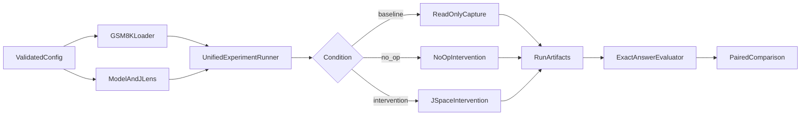

# GSM8K × J-Space benchmark planning package

This directory defines the implementation plan for a configurable GSM8K
benchmark with two directly comparable conditions:

1. a normal, observation-only baseline; and
2. a J-Space intervention run that changes selected internal activations.

The design uses the existing
[`qwen-humaneval-jlens`](../../qwen-humaneval-jlens/README.md) experiment as a
reference, but avoids copying its duplicated baseline/intervention runners and
hard-coded output paths.

## Planning documents

1. [`01-requirements-and-scope.md`](01-requirements-and-scope.md) — goals,
   definitions, non-goals, and acceptance criteria.
2. [`02-architecture-and-project-structure.md`](02-architecture-and-project-structure.md)
   — proposed package layout, component responsibilities, and run flow.
3. [`03-configuration-design.md`](03-configuration-design.md) — the complete
   YAML contract for model, benchmark, generation, capture, intervention, and
   output settings.
4. [`04-data-and-output-contracts.md`](04-data-and-output-contracts.md) —
   schemas, run manifests, activation storage, and output folder layout.
5. [`05-experiment-protocol.md`](05-experiment-protocol.md) — baseline,
   no-op control, intervention, evaluation, comparison, and reproducibility.
6. [`06-implementation-and-validation.md`](06-implementation-and-validation.md)
   — implementation sequence, tests, correctness gates, and completion
   criteria.
7. [`07-cross-platform-portability.md`](07-cross-platform-portability.md) —
   M1/MPS, NVIDIA CUDA, Radeon 8060S/ROCm, CPU/offload, memory preflight, and
   the required hardware validation matrix.
8. [`08-uv-environments-and-run-tiers.md`](08-uv-environments-and-run-tiers.md)
   — automatic uv environment selection and the M1 small, Radeon medium, and
   A100/H100 full-run promotion workflow.
9. [`09-python-and-jupyter-visualization.md`](09-python-and-jupyter-visualization.md)
   — Python analysis modules, Jupyter notebook templates, automated execution,
   and saved HTML/figure/table outputs.
10. [`10-decisions-risks-and-open-questions.md`](10-decisions-risks-and-open-questions.md)
    — unresolved prompt/model/capture choices, risk controls, and the freeze
    checklist required before the full A100/H100 experiment.

## Important measurement distinction

[`jlens/benchmark.py`](../../jlens/benchmark.py) already contains a GSM8K
loader for *teacher-forced gold next-token steering*. Its top-1/rank metrics
measure controllability, not whether the model solves a math problem. The new
project will implement full-answer generation and exact GSM8K answer accuracy
as its primary benchmark. The existing next-token benchmark may be exposed as
an optional secondary test type.

## Proposed high-level flow

## Recommended implementation order

Build the shared configuration, dataset, generation, evaluation, and artifact
layers first. Add observation-only J-Space capture next. Only after the
baseline is reproducible should intervention hooks and paired comparison be
enabled. The exact no-op control is a mandatory gate before interpreting any
intervention result.

Platform support is capability-based. The same benchmark logic must run on
MLX, MPS, CUDA, and ROCm through a device/linear-algebra abstraction, with each run's
resolved backend and fallbacks recorded. An ordinary 8 GB or 16 GB M1 cannot
hold the exact 9B experiment entirely on MPS; the implementation must detect
that constraint and require offload or a smaller model with a matching fitted
J-Lens.

All dependencies are managed with uv. A host-profile launcher selects isolated
`.venv-mlx`, `.venv-rocm`, `.venv-cuda`, or `.venv-cpu` environments and uses
uv's PyTorch backend selection. Scientific settings remain explicit: M1 Max is
the small correctness tier, Radeon 8060S is the medium validation/calibration
tier, and A100/H100 is the full benchmark tier.

The application is Python-based. Jupyter notebooks provide the readable
analysis layer over saved artifacts and export executed notebooks, standalone
HTML, figures, and backing CSV tables without rerunning the model.
