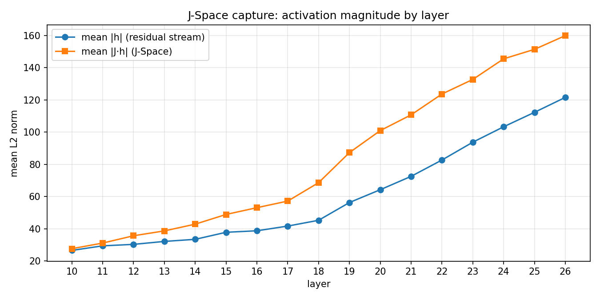

# Phase-1 baseline report — HumanEval × J-Space observation

- Model: `Qwen/Qwen3.5-9B-Base`
- Tasks run: 164
- Decoding: greedy (do_sample=false), max_new_tokens=512, seed=0
- **pass@1: 0.6037** (99/164)
- J-Lens status: `fitted` — fitted checkpoint loaded, J-Space readouts valid

## Passed tasks

- HumanEval/0
- HumanEval/2
- HumanEval/3
- HumanEval/4
- HumanEval/6
- HumanEval/7
- HumanEval/9
- HumanEval/10
- HumanEval/11
- HumanEval/12
- HumanEval/13
- HumanEval/14
- HumanEval/15
- HumanEval/16
- HumanEval/18
- HumanEval/19
- HumanEval/20
- HumanEval/21
- HumanEval/22
- HumanEval/23
- HumanEval/24
- HumanEval/25
- HumanEval/27
- HumanEval/28
- HumanEval/29
- HumanEval/30
- HumanEval/31
- HumanEval/34
- HumanEval/35
- HumanEval/38
- HumanEval/40
- HumanEval/42
- HumanEval/43
- HumanEval/44
- HumanEval/45
- HumanEval/46
- HumanEval/47
- HumanEval/48
- HumanEval/49
- HumanEval/50
- HumanEval/51
- HumanEval/52
- HumanEval/53
- HumanEval/54
- HumanEval/55
- HumanEval/56
- HumanEval/57
- HumanEval/58
- HumanEval/60
- HumanEval/61
- HumanEval/62
- HumanEval/63
- HumanEval/65
- HumanEval/66
- HumanEval/68
- HumanEval/70
- HumanEval/71
- HumanEval/72
- HumanEval/73
- HumanEval/74
- HumanEval/76
- HumanEval/78
- HumanEval/80
- HumanEval/82
- HumanEval/84
- HumanEval/85
- HumanEval/87
- HumanEval/88
- HumanEval/89
- HumanEval/94
- HumanEval/96
- HumanEval/97
- HumanEval/98
- HumanEval/102
- HumanEval/103
- HumanEval/104
- HumanEval/105
- HumanEval/109
- HumanEval/115
- HumanEval/116
- HumanEval/121
- HumanEval/122
- HumanEval/124
- HumanEval/128
- HumanEval/136
- HumanEval/140
- HumanEval/142
- HumanEval/147
- HumanEval/148
- HumanEval/149
- HumanEval/150
- HumanEval/151
- HumanEval/152
- HumanEval/153
- HumanEval/154
- HumanEval/156
- HumanEval/157
- HumanEval/158
- HumanEval/159

## Failed tasks

- HumanEval/1 (fail)
- HumanEval/5 (fail)
- HumanEval/8 (fail)
- HumanEval/17 (fail)
- HumanEval/26 (fail)
- HumanEval/32 (fail)
- HumanEval/33 (fail)
- HumanEval/36 (fail)
- HumanEval/37 (fail)
- HumanEval/39 (timeout)
- HumanEval/41 (fail)
- HumanEval/59 (fail)
- HumanEval/64 (fail)
- HumanEval/67 (fail)
- HumanEval/69 (fail)
- HumanEval/75 (fail)
- HumanEval/77 (fail)
- HumanEval/79 (fail)
- HumanEval/81 (fail)
- HumanEval/83 (fail)
- HumanEval/86 (fail)
- HumanEval/90 (fail)
- HumanEval/91 (fail)
- HumanEval/92 (fail)
- HumanEval/93 (fail)
- HumanEval/95 (fail)
- HumanEval/99 (fail)
- HumanEval/100 (timeout)
- HumanEval/101 (fail)
- HumanEval/106 (fail)
- HumanEval/107 (fail)
- HumanEval/108 (fail)
- HumanEval/110 (fail)
- HumanEval/111 (fail)
- HumanEval/112 (fail)
- HumanEval/113 (fail)
- HumanEval/114 (fail)
- HumanEval/117 (fail)
- HumanEval/118 (fail)
- HumanEval/119 (fail)
- HumanEval/120 (fail)
- HumanEval/123 (fail)
- HumanEval/125 (fail)
- HumanEval/126 (fail)
- HumanEval/127 (fail)
- HumanEval/129 (fail)
- HumanEval/130 (fail)
- HumanEval/131 (fail)
- HumanEval/132 (fail)
- HumanEval/133 (fail)
- HumanEval/134 (fail)
- HumanEval/135 (fail)
- HumanEval/137 (fail)
- HumanEval/138 (fail)
- HumanEval/139 (fail)
- HumanEval/141 (fail)
- HumanEval/143 (fail)
- HumanEval/144 (fail)
- HumanEval/145 (fail)
- HumanEval/146 (fail)
- HumanEval/155 (fail)
- HumanEval/160 (fail)
- HumanEval/161 (fail)
- HumanEval/162 (fail)
- HumanEval/163 (fail)

## J-Space capture summary

How the capture works (observation-only — activations are never modified):

```
prompt token(s) ──> transformer layer l ──> residual h ──┬──> layer l+1 (untouched)
                                                       │
                                                z = J_l · h  (J-Lens projection)
                                                       │
                                     record |h|, |z|, top-k tokens of unembed(z)
```

- Activation files: 164 tasks
- Layers observed: [10, 11, 12, 13, 14, 15, 16, 17, 18, 19, 20, 21, 22, 23, 24, 25, 26]



| layer | positions | mean |h| | mean |J·h| |
|---|---|---|---|
| 10 | 9953 | 26.58 | 27.65 |
| 11 | 9953 | 29.42 | 31.14 |
| 12 | 9953 | 30.33 | 35.68 |
| 13 | 9953 | 32.16 | 38.70 |
| 14 | 9953 | 33.46 | 42.88 |
| 15 | 9953 | 37.83 | 48.91 |
| 16 | 9953 | 38.77 | 53.11 |
| 17 | 9953 | 41.69 | 57.21 |
| 18 | 9953 | 45.28 | 68.64 |
| 19 | 9953 | 56.31 | 87.31 |
| 20 | 9953 | 64.27 | 100.97 |
| 21 | 9953 | 72.56 | 110.74 |
| 22 | 9953 | 82.70 | 123.68 |
| 23 | 9953 | 93.76 | 132.72 |
| 24 | 9953 | 103.34 | 145.52 |
| 25 | 9953 | 112.31 | 151.41 |
| 26 | 9953 | 121.58 | 159.92 |

### Example J-Space readout

File `HumanEval_0.jsonl.gz`, layer 26, final generated position 170 (token `name`), top-5 lens tokens:

- `__` (26.00)
- ` "__` (25.12)
- `__:` (24.25)
- ` __` (22.12)
- `:__` (20.75)

## Phase-2 TODOs

- `JLens.project_from_jspace` (pinv back-projection)
- intervention hooks: zero_topk / mean_replace / subtract_mean
- intervention HumanEval rerun + baseline-vs-intervention comparison
